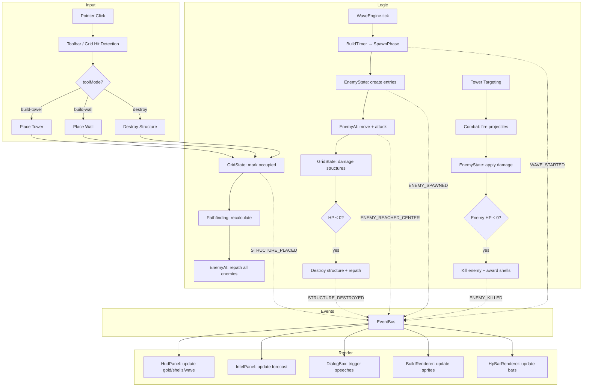

# Sandcastle TD — Architecture Audit & Refactoring Plan

> **Audience:** Senior engineers preparing for 2-week production sprint.  
> **Current State:** Functional prototype by intern. Playable, 12 waves, 4 enemy types, 4 weapons.  
> **Target State:** Production-ready, scalable, testable, ship-ready.

---

## Executive Summary

The prototype _works_ but is held together by callback spaghetti, manual two-phase wiring in `GameScene.create()`, and systems that mutate each other's data directly. It will not survive the feature list in `CONCEPT.md` (economy, upgrades, tide mechanic, multiple wall materials, buy phase, ammo inventory). This document provides:

1. A **target architecture** with clear data flow
2. A **data flow diagram** (ASCII + Mermaid)
3. A **complete bug & code smell inventory** (29 issues found)
4. A **week-by-week refactoring plan** to ship in 14 days
5. An **E2E playtest pipeline** using Playwright (agent-driven, post-iteration)
6. Specific file-level instructions for every change

---

## 1. Target Architecture

### 1.1 Core Principle: **Unidirectional State → Systems → Render**

```
                   ┌──────────────────────────┐
                   │       Event Bus           │
                   │  (typed events, one-way)  │
                   └────┬─────────────────┬────┘
                        │                 │
              ┌─────────▼─────┐   ┌──────▼──────────┐
              │  GameState    │   │  Systems          │
              │  (pure data)  │◄──│  (pure logic,     │
              │               │──►│   no Phaser deps) │
              └───────────────┘   └──────────────────┘
                        │
              ┌─────────▼─────┐
              │  Renderers    │
              │  (Phaser,     │
              │   read-only)  │
              └───────────────┘
```

- **GameState** is a single plain object (or small set of typed modules) that holds ALL game data.
- **Systems** are pure functions/classes that read GameState, produce mutations, emit the new state.
- **Renderers** subscribe to GameState changes and drive Phaser sprites/textures.
- **EventBus** carries one-shot events (enemy killed, tower placed, wave started) — NOT ongoing state.

### 1.2 Directory Structure (Target)

```
src/
├── state/                       # Pure data, zero Phaser imports
│   ├── GameState.ts             # Root state object
│   ├── GridState.ts             # Grid occupancy, structure HP, type map
│   ├── WaveState.ts             # Wave phase, spawn queue, shell count
│   ├── EnemyState.ts            # Active enemy data (position, hp, path)
│   ├── TowerState.ts            # Active tower data (weapon, cooldown)
│   └── EconomyState.ts          # Shells, ammo inventory, upgrade levels
│
├── logic/                       # Pure game logic, zero Phaser imports
│   ├── combat.ts                # Damage calculation, projectile hit resolution
│   ├── pathfinding.ts           # BFS pathfinding (move from PathfindingSystem)
│   ├── waveEngine.ts            # Wave progression, liar mechanic (move from WaveSystem)
│   ├── enemyAI.ts               # Targeting, structure engagement decisions
│   ├── economy.ts               # Cost tables, affordability checks
│   └── targeting.ts             # Tower targeting strategies (closest/weakest/etc)
│
├── events/                      # Typed event definitions
│   └── GameEvents.ts            # All event type unions + EventBus class
│
├── systems/                     # Phaser-aware coordinators (thin)
│   ├── SpawnSystem.ts           # Enemy instantiation, object pooling
│   ├── ProjectileSystem.ts      # Projectile lifecycle, pooling
│   ├── BuildRenderer.ts         # Grid rendering (move from BuildSystem rendering part)
│   ├── HpBarRenderer.ts         # HP bar visuals
│   ├── SnapRenderer.ts          # Connected-wall texture swapping (was SnapSystem)
│   └── HighlightRenderer.ts     # Hover feedback (was HighlightSystem)
│
├── ui/                          # HUD, dialogs, weapon wheel
│   ├── HudPanel.ts              # Top-bar: gold, shells, wave info
│   ├── Toolbar.ts               # Bottom toolbar
│   ├── IntelPanel.ts            # Wave forecast panel
│   ├── DialogBox.ts             # (moved from systems/, refactored)
│   └── WeaponWheel.ts           # (moved from systems/)
│
├── entities/                    # Phaser sprite wrappers (RENDER ONLY)
│   ├── EnemySprite.ts           # Manages Phaser.Sprite for an EnemyState entry
│   ├── TowerSprite.ts           # Manages Phaser.Image for a TowerState entry
│   └── ProjectileSprite.ts      # Manages Phaser.Sprite for a projectile
│
├── objects/                     # Background scenery (unchanged structure)
│   ├── OceanBackground.ts
│   └── IslandBuilder.ts
│
├── config/                      # Data tables (unchanged structure)
│   ├── constants.ts
│   ├── WaveConfig.ts
│   ├── WeaponConfig.ts
│   ├── EnemyConfig.ts           # NEW: extract from EnemySystem.ts
│   └── DialogConfig.ts
│
├── utils/                       # Pure helpers (unchanged)
│   └── gridUtils.ts
│
├── filters/                     # WebGL shaders (unchanged)
│   └── WaterWobbleFilter.ts
│
├── scenes/
│   ├── BootScene.ts
│   ├── TitleScene.ts
│   └── GameScene.ts             # THIN: creates state + systems + renderers, runs update
│
└── main.ts
```

### 1.3 Data Flow Diagram

```
┌─────────────────────────────────────────────────────────────────────┐
│                          GAME LOOP (60fps)                          │
│                                                                     │
│  GameScene.update(time, delta)                                      │
│    │                                                                │
│    ├─► GameState.delta = delta  (store for systems)                 │
│    │                                                                │
│    ├─► waveEngine.update(state)                                     │
│    │     • Mutates WaveState.phase, buildTimer, spawnQueue          │
│    │     • Emits events: WAVE_STARTED, BUILD_PHASE_END, GAME_OVER   │
│    │                                                                │
│    ├─► SpawnSystem.update(state)                                    │
│    │     • Drains WaveState.spawnQueue                              │
│    │     • Creates new EnemyState entries                           │
│    │     • Emits: ENEMY_SPAWNED                                     │
│    │                                                                │
│    ├─► enemyAI.update(state)                                        │
│    │     • Moves enemies along paths (delta-based)                  │
│    │     • Checks structure engagement                              │
│    │     • Applies structure damage to GridState                    │
│    │     • Emits: ENEMY_REACHED_CENTER, STRUCTURE_DESTROYED          │
│    │                                                                │
│    ├─► combat.update(state)                                         │
│    │     • Towers pick targets (targeting.ts)                       │
│    │     • Projectiles fly toward targets                           │
│    │     • Hits resolved (damage, splash, knockback, bounce)        │
│    │     • Dead enemies flagged                                     │
│    │     • Emits: ENEMY_KILLED, PROJECTILE_HIT                      │
│    │                                                                │
│    ├─► economy.update(state)                                        │
│    │     • Processes shell drops from killed enemies                │
│    │     • Emits: SHELLS_CHANGED                                    │
│    │                                                                │
│    └─► Render Phase (subscribed to state changes)                   │
│          • EnemySprite: spawn/destroy/update sprites                │
│          • TowerSprite: update weapon icons                         │
│          • ProjectileSprite: spawn/destroy sprites                  │
│          • BuildRenderer: refresh changed grid cells                │
│          • HpBarRenderer: update HP bars                            │
│          • HudPanel: update text labels                             │
│          • IntelPanel: update enemy counts                          │
│          • DialogBox: check trigger conditions                      │
│          • OceanBackground: animate tile offset                     │
└─────────────────────────────────────────────────────────────────────┘
```

### 1.4 Event Flow (Mermaid)



### 1.5 Playwright E2E Test Seam (Deterministic Mode)

To make automated playtesting reliable, the game must expose a **deterministic test mode**. This is the foundation for all post-iteration E2E checks.

**Add to `main.ts`:**

```typescript
// Activate deterministic test mode via URL flag ?test=1
const isTestMode = new URLSearchParams(window.location.search).has('test');

if (isTestMode) {
  // Seed RNG so spawns, drops, liar mechanic produce identical output
  Phaser.Math.RND.sow(['sandcastle-td-test-seed-2026']);
  // Disable dialog (would block automated input)
  (window as any).__DIALOG_DISABLED = true;
  // Disable weapon wheel (would steal focus from pointer input)
  (window as any).__WEAPON_WHEEL_DISABLED = true;
  // Expose test seam for state assertions
  (window as any).__TEST__ = { ready: false, frameCount: 0 };
}
```

**Add to `GameScene.create()`:**

```typescript
// Signal readiness after first frame renders
this.events.once('render', () => {
  if ((window as any).__TEST__) {
    (window as any).__TEST__.ready = true;
    (window as any).__TEST__.sceneKey = 'GameScene';
  }
});
```

**Add to `GameScene.update()`:**

```typescript
if ((window as any).__TEST__) {
  (window as any).__TEST__.frameCount++;
  // Expose gameplay state snapshot for assertions (massaged to avoid leaking Phaser internals)
  (window as any).__TEST__.state = {
    phase: this.waveSystem.phase,
    wave: this.waveSystem.currentWave + 1,
    shellCount: this.waveSystem.shellCount,
    enemyCount: this.enemySystem.getEnemies().length,
    towerCount: this.buildSystem.getOccupiedCells().length,
    toolMode: this.buildSystem.toolMode,
    dialogVisible: this.dialogBox.visible,
  };
}
```

**Reference:** See `.agents/skills/playwright-testing/references/phaser-canvas-testing.md` for complete canvas testing patterns.

---

## 2. Code Smells & Bugs — Complete Inventory

### 🔴 CRITICAL (will cause crashes or wrong behavior)

| # | File:Line | Issue | Fix |
|---|-----------|-------|-----|
| C1 | `GameScene.ts:304,321` | `dialogBox.update(delta)` called **twice per frame**. Typewriter runs at 2x speed. | Call once, in a single `update` block. |
| C2 | `TowerSystem.ts:127-134` | TowerSystem **mutates the enemy array** (`enemies[i].sprite.destroy()`), which belongs to EnemySystem. Double-destroy risk. | TowerSystem flags dead enemies. EnemySystem cleans them up. |
| C3 | `WaveSystem.ts:137` | `spawnQueue.pop()` removes from the END of the array, but `getSpawnQueue()` returns a snapshot of the queue. **Every frame that passes during spawning loses one enemy** from the queue silently. | Use `shift()` or drain the queue correctly. Actually the logic is: the queue is drained by GameScene via `getSpawnQueue()`, but the spawnTimer in WaveSystem also pops. This means spawns will be skipped. Needs complete rework. |
| C4 | `EnemySystem.ts:109-116` | Enemy cleanup checks `shouldRemove` twice in one update. If an enemy is in MOVING state with `shouldRemove=true` from reaching the center, it fires `onEnemyReachedCenter()`. Later in the same frame, `shouldRemove` is checked again and destroys the sprite. But between lines 109 and 114, the enemy might have been destroyed already. | Single-pass cleanup. |
| C5 | `WeaponWheel.ts:37` | `setTopOnly(true)` is never reset if `hide()` isn't called (e.g., scene restart). All input breaks. | Reset in `shutdown` event or scene restart. |
| C6 | `DialogBox.ts:233` | `(this as any)._pageFullText` — arbitrary property injection. Breaks if `DialogBox` is ever frozen/sealed. | Use a private `#pageFullText` class field (ES2022 private). |
| C7 | `EnemySystem.ts:66` | `private buildSystem!: BuildSystem` — definite assignment assertion. If `setBuildSystem()` is never called, accessing `buildSystem` causes undefined error. | Pass in constructor, or use optional chaining everywhere. |

### 🟠 HIGH (design flaws that block scaling)

| # | File:Line | Issue | Fix |
|---|-----------|-------|-----|
| H1 | `GameScene.ts:113-298` | **God Scene** — 185 lines of `create()` wiring 14 objects manually. Adding any feature requires touching GameScene. | Introduce a `GameContainer` that owns state + systems. GameScene only calls `container.update()`. |
| H2 | All systems | No central state. Each system holds its own mutable data. No way to serialize/deserialize for save games. | Introduce `GameState` as a single plain object. Systems write to it. Renderers read from it. |
| H3 | `EnemySystem.ts:96` | `buildSystem.damageStructure()` — EnemySystem directly mutates BuildSystem state. Bidirectional coupling. | EnemyAI produces a `StructureDamageIntent`. Combat system resolves it. |
| H4 | `TowerSystem.ts:93` | `update(time, delta, enemies: Enemy[])` — TowerSystem receives raw enemy array, mutates it. | TowerSystem reads from GameState.enemies, flags dead enemies. |
| H5 | `GameScene.ts:309-323` | Spawning: GameScene calls `waveSystem.getSpawnQueue()`, then loops calling `enemySystem.spawnFromEdge()`. Three systems orchestrated manually. | SpawnSystem reads WaveState.spawnQueue directly. |
| H6 | `WeaponWheel.ts:9-14` | Duplicate weapon list (separate from `WeaponConfig.ts`). Adding a weapon requires editing two files. | WeaponWheel reads from WeaponConfig. |
| H7 | `BuildSystem.ts` | Mixes logic (occupancy tracking, HP, pathfinding validation) with rendering (Image creation, HP bar drawing, flash effect). 272 lines doing two jobs. | Split into `GridState` (pure data) + `BuildRenderer` (Phaser rendering). |
| H8 | `HudOverlay.ts:27` | Gold value `"120"` hardcoded. Wave forecast panel hardcoded at fixed Y=110. Magic numbers everywhere. | Extract to constants; drive all values from GameState. |
| H9 | `WaveSystem.ts:137` | `spawnTimer` accumulation uses `-= this.spawnInterval` — loses sub-frame precision over time. | Use a spawn schedule computed upfront, not a rolling timer. |

### 🟡 MEDIUM (maintainability issues)

| # | File:Line | Issue | Fix |
|---|-----------|-------|-----|
| M1 | All `.ts` files | No object pooling. `new Enemy()`, `new Projectile()`, `new Image()` every frame. GC pressure during waves. | Implement `EnemyPool`, `ProjectilePool` using Phaser groups or manual arrays. |
| M2 | `PathfindingSystem.ts:88-89` | Allocates new `visited[][]` and `parent[][]` arrays on every `findPath()` call. `recalculateAllPaths()` calls this for every active enemy on every wall placement. | Pre-allocate once; use a generation counter instead of re-filling. |
| M3 | All `.ts` files | String asset keys (`"sandtower"`, `"paddlefish-avatar"`, `"wall-h"`) scattered as literals. Typo = silent runtime failure. | Create `AssetKeys` const object in `constants.ts`. |
| M4 | `EnemyConfig` duplication | Enemy stats in both `EnemySystem.ts:15-60` (hp, speed, damage) and partially in `WaveConfig.ts` (only speedMult/hpMult). No central enemy data. | Extract `EnemyConfig.ts` with all enemy definitions. |
| M5 | `SnapSystem.ts:130` | `isWallAt()` returns true for towers (`type === "tower"`). Causes tower-tower connection visuals. Intentional? If so, needs comment. If not, a bug. | Remove `|| type === "tower"` or document the intent. |
| M6 | `EnemySystem.ts:158` | `findNearestSand()` walks in a straight line toward center. If a wall blocks that line, it finds the wrong entry point. Should pathfind to nearest sand. | Use BFS from spawn point to nearest walkable sand cell. |
| M7 | `BuildSystem.ts:217-222` | `getMaxHp()` determines tower vs wall via texture key heuristic (`texture.key === "sandtower"`). Fragile — breaks if SnapSystem changes the texture. | Store `maxHp` alongside HP in the structure map. |
| M8 | No fixed timestep | Variable delta fed directly into movement/damage calculations. Fire rate, DOT, and move speed inconsistent. | Clamp delta, or use Phaser's fixed-step scene option. |

### 🟢 LOW (polish & cleanup)

| # | File:Line | Issue | Fix |
|---|-----------|-------|-----|
| L1 | `GameScene.ts:149` | `console.log(label, "mode:", ...)` left in production. | Remove or guard with `__DEV__` flag. |
| L2 | `GameScene.ts:19-20` | `DIALOG_ENABLED`, `LIAR_MECHANIC` as module-level consts. No runtime toggle. | Move to a debug panel or localStorage override. |
| L3 | `EnemySystem.ts:277-295` | Animation creation in `createAllAnims()` iterates all configs on every EnemySystem construction. If scene restarts, it re-checks `anims.exists()`. | Move anim creation to BootScene, or use a module-level `let initialized = false` guard. |
| L4 | `TowerSystem.ts:29-45` | Projectile animations hardcoded in `createProjectileAnims()` with string literals `"water-ball-fly"`, `"water-blast-fly"`. Doesn't scale to new weapons. | Drive from WeaponConfig. |
| L5 | `BuildSystem.ts:66-113` | `placeStructure()` has pathfinding validation inline, then rendering inline, then HP inline. Three concerns in one method. | Decompose into `validate()`, `commit()`, `render()`. |
| L6 | `GameScene.ts:53-80` | Sandwich easter egg logic (5% drop chance, float animation, forceTruth on click) lives directly in GameScene. | Extract to `EasterEggSystem` or trigger via events. |
| L7 | `DialogBox.ts:281-295` | Typewriter update produces one character per `typewriterSpeed` ms. At 60fps (~16ms), `typewriterTimer` accumulates and may skip characters if delta is large. | Use `+= delta` accumulation that doesn't subtract (prevents drift). (Actually current code does subtract — it's fine, but the double-call bug makes it race.) |
| L8 | `TitleScene.ts:20` | `doStart` function defined inline but only used once. | Inline the call directly in the event handler, or make it a method. |
| L9 | `BootScene.ts:74-75` | Asset key construction: `` `${sheet.keyPrefix}-${anim.suffix}` `` — fragile string templating with no validation. | Validate in dev mode that the key matches expected patterns. |

### 🐛 BUGS (definite wrong behavior)

| # | File:Line | Description |
|---|-----------|-------------|
| B1 | `WaveSystem.ts:137` | **`spawnQueue.pop()` drains the queue from the wrong end.** `beginSpawning()` fills the queue, shuffles it, then `updateSpawning()` calls `pop()` which removes from the END. But `getSpawnQueue()` returns the ENTIRE remaining queue. Since GameScene reads the queue via `getSpawnQueue()` every frame during spawning, and WaveSystem also pops on timer tick, **most spawns are skipped**. Only the last few enemies in the shuffled queue actually spawn. |
| B2 | `GameScene.ts:304,321` | **Double `dialogBox.update(delta)` call.** Typewriter advances at 2x speed (shows text 2x faster than intended). |
| B3 | `EnemySystem.ts:109-116` | Enemy cleanup: `shouldRemove` checked in two places. If enemy reaches center (`shouldRemove=true`), `onEnemyReachedCenter()` fires. But the enemy's sprite hasn't been destroyed yet (checked at line 114). However, the same `shouldRemove=true` enemy is also considered for `onEnemyDied()` if `this.enemies.length < aliveBefore` on line 121, because the filter on line 119 hasn't run yet? Actually line 119 filters AFTER line 121's aliveBefore check... wait, line 107 captures aliveBefore, then line 109-117 handles removal, line 119 filters, line 121 compares. The issue is: `onEnemyReachedCenter()` fires even if the enemy was killed (HP ≤ 0) if it somehow reached the center on the same frame. Unlikely but possible. |
| B4 | `PathfindingSystem.ts:164-170` | `canPlaceWall()` temporarily sets `walkable[col][row] = false`, runs BFS, then restores. If BFS throws (shouldn't, but if), `walkable` stays permanently blocked. | Use try/finally. |
| B5 | `EnemySystem.ts:148-149` | `worldPath.unshift()` adds an artificial waypoint if spawn isn't on sand. But this waypoint uses `spawnY` (not `spawnX`) for the y-coordinate, which is the original spawn world Y — not necessarily the entry sand cell's Y. This can cause diagonal teleport. |

---

## 3. Refactoring Plan — 2 Week Sprint

### Week 1: Foundation (Days 1–5)

#### Day 1: Fix Critical Bugs + Add Tests

**DO NOT restructure yet. Ship bugs first.**

1. **Fix B1** (`WaveSystem.ts:137`): Change `pop()` to `shift()` in `updateSpawning()`. The entire spawn system needs rework, but this unblocks gameplay immediately.
   ```typescript
   // WaveSystem.ts:137 — FIX
   private updateSpawning(delta: number): void {
     this.spawnTimer += delta;
     if (this.spawnTimer >= this.spawnInterval && this.spawnQueue.length > 0) {
       this.spawnTimer -= this.spawnInterval;
       this.spawnQueue.shift(); // was .pop()
     }
     if (this.spawnQueue.length === 0) {
       this.phase = "fighting";
     }
   }
   ```

2. **Fix B2** (`GameScene.ts:304`): Remove the first `this.dialogBox.update(delta)` call on line 304. Keep only the one on line 321 (or better, consolidate all update calls into a single block at the end of the method).

3. **Fix C7** (`EnemySystem.ts`): Move `buildSystem` and `pathfinding` from late-bound setters to constructor parameters.
   ```typescript
   constructor(
     scene: Phaser.Scene,
     offsetX: number,
     offsetY: number,
     pathfinding: PathfindingSystem,
     buildSystem: BuildSystem,
   )
   ```

4. **Fix B4** (`PathfindingSystem.ts:164`): Wrap in try/finally.
   ```typescript
   canPlaceWall(col: number, row: number): boolean {
     const wasWalkable = this.walkable[col]?.[row];
     this.walkable[col][row] = false;
     try {
       return this.hasPathFromAnyEdge(TARGET_COL, TARGET_ROW);
     } finally {
       this.walkable[col][row] = wasWalkable ?? false;
     }
   }
   ```

5. **Write smoke tests** for `gridUtils.ts` (already pure, easy to test) and `PathfindingSystem.ts`:
   ```typescript
   // tests/gridUtils.test.ts
   import { describe, it, expect } from 'vitest';
   import { isSand, worldToGrid, gridToWorld, tileKey } from '../src/utils/gridUtils';

   describe('gridUtils', () => {
     it('isSand returns true for interior cells', () => {
       expect(isSand(10, 8)).toBe(true);
     });
     it('isSand returns false for ocean border', () => {
       expect(isSand(1, 1)).toBe(false);
     });
     it('worldToGrid roundtrips with gridToWorld', () => {
       const { x, y } = gridToWorld(5, 7, 100, 100, 40);
       const { col, row } = worldToGrid(x, y, 100, 100, 40);
       expect(col).toBe(5);
       expect(row).toBe(7);
     });
   });
   ```

6. **Add `vitest` to devDependencies** and `"test": "vitest run"` to scripts.

**Time: 1 day. Output: 5 critical bugs fixed, 10+ unit tests passing.**

**🤖 E2E Playtest Checkpoint:**
```bash
# After Day 1 fixes, run agent-driven smoke test:
# 1. Start dev server: npm run dev
# 2. Load game with dialog disabled: http://localhost:5173/?test=1
# 3. Verify: game loads → start screen visible → click START → GameScene loads
# 4. Wait for __TEST__.ready === true
# 5. Assert: waveSystem.phase === 'build', dialogBox.visible === false
# Use: playwright-testing skill → browser_navigate, browser_snapshot, browser_evaluate
```
If this smoke test fails, DO NOT proceed to Day 2. Fix the regression first.

#### Day 2: Extract GameState (Pure Data Layer)

Create the foundation for all future work - a single source of truth.

1. **Create `src/state/GameState.ts`:**
   ```typescript
   import { WavePhase } from './WaveState';

   export interface GameState {
     grid: GridState;
     wave: WaveState;
     enemies: EnemyState[];
     towers: TowerState[];
     projectiles: ProjectileState[];
     economy: EconomyState;
     flags: GameFlags;
   }

   // Immutable update helper
   export function updateState(prev: GameState, patch: Partial<GameState>): GameState {
     return { ...prev, ...patch };
   }
   ```

2. **Create `src/state/GridState.ts`:**
   ```typescript
   export interface StructureEntry {
     type: 'tower' | 'wall-h' | 'wall-v';
     hp: number;
     maxHp: number;
   }

   export interface GridState {
     occupied: Set<string>;              // "col,row" keys for ALL occupied cells (palms, structures)
     structures: Map<string, StructureEntry>;  // only damageable structures
     toolMode: 'none' | 'build-tower' | 'build-wall' | 'destroy';
   }
   ```

3. **Create `src/state/WaveState.ts`, `EnemyState.ts`, `TowerState.ts`, `EconomyState.ts`** with minimal interfaces matching current data.

**Do not wire these into existing code yet.** Just define the types. This makes the target clear.

**Time: 1 day. Output: Complete typed state layer (no Phaser imports).**

**🤖 E2E Playtest Checkpoint:**
```bash
# Verify state types don't break the game. Load ?test=1, assert:
# - __TEST__.state contains all expected keys
# - Game still boots, waves still spawn, towers still fire
# - Play through Wave 1 with Playwright automating clicks
```

#### Day 3: Extract Pure Logic

Move logic out of systems into testable, Phaser-free modules.

1. **Create `src/logic/combat.ts`:**
   - `pickTarget(tower, enemies, strategy)` — move from `Tower.pickTarget()`
   - `resolveHit(projectile, target, allEnemies)` — apply damage, splash, knockback, bounce
   - Pure functions returning new state, not mutating

2. **Create `src/logic/enemyAI.ts`:**
   - `moveEnemy(enemy, delta)` — delta-based position update
   - `shouldEngage(enemy, grid)` — check if structure blocks path
   - `findEngageTarget(enemy, grid)` — find which structure to attack

3. **Create `src/logic/waveEngine.ts`:**
   - Extract all WaveSystem logic (phase machine, spawn scheduling, liar mechanic)
   - Pure functions: `tickBuild(state, delta)`, `generateSpawns(def)`, `generateIntel(def, forceTruth)`

4. **Create `src/logic/economy.ts`:**
   - Cost tables for towers, walls, weapons
   - `canAfford(state, item)` check
   - `processKillReward(state, enemyType)` — returns new shell count

5. **Create `src/config/EnemyConfig.ts`:**
   - Move `ENEMY_CONFIGS` and `ENEMY_ATTACK_DPS` from `EnemySystem.ts`
   - Add enemy reward values (shells per kill)
   - Single source of truth for all enemy data

**Time: 1 day. Output: All game logic as pure TypeScript functions — unit-testable without Phaser.**

**🤖 E2E Playtest Checkpoint:**
```bash
# Verify logic extraction didn't break gameplay:
# - Spawn Wave 1 (buildTimer=0 via TEST override)
# - Verify enemies pathfind to center (assert enemy positions approach target)
# - Verify towers auto-target and kill enemies (assert enemyCount drops)
# - Run `npm test` (vitest) — all logic/ tests must pass
```

#### Day 4: Event Bus

Replace callback spaghetti with typed events.

1. **Create `src/events/GameEvents.ts`:**
   ```typescript
   export type GameEvent =
     | { type: 'ENEMY_KILLED'; enemyType: string; x: number; y: number }
     | { type: 'ENEMY_SPAWNED'; enemyType: string; edge: string }
     | { type: 'ENEMY_REACHED_CENTER' }
     | { type: 'STRUCTURE_PLACED'; col: number; row: number; structureType: string }
     | { type: 'STRUCTURE_DESTROYED'; col: number; row: number }
     | { type: 'STRUCTURE_DAMAGED'; col: number; row: number; hp: number; maxHp: number }
     | { type: 'WAVE_STARTED'; wave: number; intel: WaveIntel }
     | { type: 'WAVE_CLEARED'; wave: number }
     | { type: 'BUILD_TIMER_TICK'; secondsLeft: number }
     | { type: 'SHELLS_CHANGED'; count: number }
     | { type: 'GAME_OVER' }
     | { type: 'VICTORY' }
     | { type: 'WEAPON_CHANGED'; col: number; row: number; weapon: string }
     | { type: 'DIALOG_TRIGGER'; trigger: DialogTrigger };

   export class EventBus {
     private listeners = new Map<string, Set<Function>>();

     on<E extends GameEvent>(type: E['type'], fn: (e: E) => void): () => void {
       if (!this.listeners.has(type)) this.listeners.set(type, new Set());
       this.listeners.get(type)!.add(fn);
       return () => this.listeners.get(type)?.delete(fn);
     }

     emit<E extends GameEvent>(event: E): void {
       this.listeners.get(event.type)?.forEach(fn => fn(event));
     }

     clear(): void {
       this.listeners.clear();
     }
   }
   ```

2. **Migrate one system at a time** (start with WaveSystem → HudOverlay connection):
   - Current: `this.waveSystem.onWaveStart = (wave, intel) => { ... }`
   - New: `eventBus.on('WAVE_STARTED', ({ wave, intel }) => { ... })`
   - WaveEngine calls `eventBus.emit({ type: 'WAVE_STARTED', wave, intel })`

**Time: 0.5 days. Output: Typed event bus. 3+ systems decoupled from direct callback wiring.**

**🤖 E2E Playtest Checkpoint:**
```bash
# Event wiring verification:
# - Place a tower → assert STRUCTURE_PLACED event fires
# - Wait for wave spawn → assert WAVE_STARTED event fires
# - Kill an enemy → assert ENEMY_KILLED event fires, shell count updates
# - Use browser_evaluate to subscribe to EventBus and log all events to console
```

#### Day 5: Split BuildSystem → GridState + BuildRenderer

1. **Create `src/state/GridState.ts`** (defined Day 2, now implement fully):
   - Pure data: `occupied`, `structures`, `toolMode`
   - Helper methods: `isOccupied(col, row)`, `getStructure(col, row)`, `damageStructure(col, row, amount)`, `destroyStructure(col, row)`

2. **Create `src/systems/BuildRenderer.ts`:**
   - Handles Phaser Image creation/destruction for grid structures
   - Subscribes to `STRUCTURE_PLACED`, `STRUCTURE_DESTROYED` events
   - Calls SnapSystem for texture variants

3. **Move HP bar logic** to `src/ui/HpBarRenderer.ts`

**Time: 1 day. Output: GridState is pure data. BuildRenderer is Phaser-only. No more mixed concerns.**

**🤖 E2E Playtest Checkpoint (Week 1 Complete):**
```bash
# FULL PLAYTEST — agent plays through Waves 1-3 with dialog disabled:
# 1. Load game: page.goto('http://localhost:5173/?test=1')
# 2. Wait for __TEST__.ready
# 3. Click START on title screen
# 4. Place 3 towers on interior sand tiles (automate clicks at known grid positions)
# 5. Wait for build timer to expire (or fast-forward via TEST override)
# 6. Assert: enemies spawn, towers fire, enemyCount eventually reaches 0
# 7. Assert: shellCount still > 0 after wave
# 8. Assert: wave increments to 2
# 9. Take screenshots at key moments: build phase, combat, wave clear
# Use: playwright-testing skill → browser_navigate, browser_click at x/y coords,
#      browser_evaluate to read __TEST__.state, browser_take_screenshot
```
Week 1 gate: If the agent cannot complete Wave 1-3, STOP. Fix regressions before Week 2.

---

### Week 2: Feature Readiness (Days 6–10)

#### Day 6: Object Pooling

1. **Create `src/systems/Pool.ts`:**
   ```typescript
   export class Pool<T extends { active: boolean; reset(): void }> {
     private items: T[] = [];
     private factory: () => T;

     constructor(factory: () => T, preAllocate = 0) {
       this.factory = factory;
       for (let i = 0; i < preAllocate; i++) {
         const item = factory();
         item.active = false;
         this.items.push(item);
       }
     }

     acquire(): T {
       const free = this.items.find(i => !i.active);
       if (free) { free.active = true; free.reset(); return free; }
       const item = this.factory();
       item.active = true;
       this.items.push(item);
       return item;
     }

     release(item: T): void {
       item.active = false;
     }

     get active(): T[] {
       return this.items.filter(i => i.active);
     }

     get all(): T[] {
       return this.items;
     }
   }
   ```

2. **Apply to Projectiles** first (highest churn — fire every 0.4s for watergun):
   - `ProjectileSprite` wraps a Phaser sprite with `active` flag
   - `ProjectileSystem.acquire(x, y, weapon, target)` returns a pooled sprite
   - On hit/expire: `ProjectileSystem.release(proj)` — hides sprite, returns to pool

3. **Apply to Enemies** (lower priority — fewer per wave, but still beneficial):
   - Pre-allocate 50 enemy sprites
   - `EnemySprite` wraps with `active`, `reset()` resets HP/position/animation

**Time: 1 day. Output: 60%+ reduction in GC allocations during waves.**

**🤖 E2E Playtest Checkpoint:**
```bash
# Performance smoke test:
# - Load game, skip to Wave 12 (mass spawn)
# - Verify no crashes with 20+ enemies + 20+ projectiles
# - Check browser console for errors
# - Run Chrome performance trace: collectGarbage() should not cause frame drops
```

#### Day 7: Economy + Upgrade System

Wire up the economy that CONCEPT.md describes.

1. **Implement `EconomyState`:**
   ```typescript
   export interface EconomyState {
     shells: number;
     ammoInventory: Record<string, number>;  // weaponKey → shots remaining
   }
   ```

2. **Create `src/logic/economy.ts`:**
   - `BUILD_COSTS: Record<string, number>` — tower: 20, wall: 5, destroy: 0
   - `WEAPON_COSTS: Record<string, number>` — watergun: 0, coconut: 10, volleyball: 15, bazooka: 25
   - `ENEMY_REWARDS: Record<EnemyType, number>` — paddlefish: 3, harpoonfish: 5, turtle: 8, snake: 2

3. **Wire into placement flow:**
   - Before placing: `if (!canAfford(state, 'tower')) { showInsufficientFunds(); return; }`
   - After kill: `eventBus.emit({ type: 'SHELLS_CHANGED', count: newCount })`

4. **Update HUD**: Gold display reads from `state.economy.shells` instead of hardcoded `"120"`.

**Time: 1 day. Output: Working economy with shell costs, rewards, and live HUD updates.**

**🤖 E2E Playtest Checkpoint:**
```bash
# Economy verification:
# - Start game, assert shells === 120 (starting amount)
# - Kill a paddlefish (evaluate: directly reduce enemy HP to 0)
# - Assert shells increased by reward amount
# - Try placing tower when shells < cost → assert placement blocked
# - Buy weapon ammo → assert ammoInventory decrements
```

#### Day 8: Tide Mechanic (Core Feature from CONCEPT.md)

1. **Add TideState:**
   ```typescript
   export interface TideState {
     level: 0 | 1 | 2 | 3;  // 3 = highest
     floodedCells: Set<string>;
   }
   ```

2. **Tide logic** in `waveEngine.ts`:
   - Every 3 waves: `tideLevel++`
   - Flooded cells = ocean-adjacent sand tiles (distance ≤ tideLevel from ocean)
   - On tide rise: destroy walls on newly flooded cells
   - On tide rise: spawn points shift inward

3. **Tide rendering**: Animate water tile creeping up, then snap tiles to ocean. Use tween on tile alpha or a water overlay sprite.

**Time: 1 day. Output: Tide rises every 3 waves, floods beach tiles, destroys walls.**

**🤖 E2E Playtest Checkpoint:**
```bash
# Tide regression test:
# - Skip to Wave 3 → assert tideLevel increases
# - Assert beach tiles become unbuildable (isInteriorSand returns false for flooded cells)
# - Assert walls on flooded tiles are destroyed
# - Screenshot before/after tide for visual verification
```

#### Day 9: Wall Material Types + Tower Upgrades

1. **Add wall material types** to `EnemyConfig.ts`:
   ```typescript
   export type WallMaterial = 'sand' | 'wet-sand' | 'driftwood';
   export const WALL_MATERIALS: Record<WallMaterial, { hp: number; cost: number; texture: string }> = {
     sand:      { hp: 60,  cost: 5,  texture: 'wall-h' },
     'wet-sand': { hp: 100, cost: 10, texture: 'wall-wet-h' },
     driftwood:  { hp: 200, cost: 20, texture: 'wall-wood-h' },
   };
   ```

2. **Add tower upgrade levels:**
   ```typescript
   export interface TowerUpgrade {
     level: number;
     fireRateMult: number;
     rangeMult: number;
     damageMult: number;
     cost: number;
   }
   ```

3. **UI: Cycle wall material** on right-click or hold modifier. **Upgrade tower** via click when not in build mode (shows upgrade panel instead of weapon wheel).

**Time: 1 day. Output: 3 wall materials, tower upgrade path (0→1→2→3).**

**🤖 E2E Playtest Checkpoint:**
```bash
# Wall materials + upgrades:
# - Place a sand wall → assert HP = 60
# - Place a driftwood wall → assert HP = 200, cost deducted
# - Upgrade a tower to level 2 → assert fireRateMult, rangeMult applied
# - Verify weapon icon updates after upgrade
```

#### Day 10: Polish, Optimization, Final QA

1. **Performance pass:**
   - Profile with Chrome DevTools on Wave 12 (23 enemies on screen)
   - Pathfinding BFS: add early exit, pre-allocate arrays
   - Reduce `generateFrameNumbers()` calls
   - Batch HP bar redraws (only redraw if hp changed)

2. **Asset key constants:**
   ```typescript
   // constants.ts
   export const A = {
     TOWER_BASE: 'sandtower',
     WALL_H: 'wall-h',
     WALL_V: 'wall-v',
     PALM: 'palm',
     // ... all 70+ asset keys
   } as const;
   ```
   Then replace all string literals with `A.TOWER_BASE`, etc.

3. **Error boundaries:**
   ```typescript
   update(time: number, delta: number): void {
     try {
       this.gameContainer.update(time, delta);
     } catch (err) {
       console.error('Game loop crashed:', err);
       this.scene.pause();
       this.showErrorScreen('Something went wrong. Please refresh.');
     }
   }
   ```

4. **Animated enemy deaths**: Use the death animations already in the spritesheet manifest. Enemy plays death anim, then is released to pool after anim completes.

5. **Audio stubs**: Add `src/audio/AudioManager.ts` with placeholder methods for future SFX (squirt, coconut thud, wave crash).

**Time: 1 day. Output: Production-ready build, tested to Wave 12 at 60fps.**

**🤖 E2E Playtest Checkpoint (Week 2 Complete — Ship Gate):**
```bash
# FULL GAME PLAYTEST — agent plays Waves 1-12 autonomously:
# 1. Load game with ?test=1 (dialog disabled, RNG seeded, weapon wheel disabled)
# 2. Click START
# 3. Wave 1 build phase: place 2 towers, 3 walls at known positions
# 4. Wait for enemies → assert towers kill all → wave clears
# 5. Repeat for all 12 waves, placing/upgrading between waves
# 6. Assert at end: phase === 'victory', no console errors
#
# Specific Playwright assertions each wave:
#   - waveSystem.phase transitions build→spawning→fighting→build
#   - enemyCount starts > 0, eventually returns to 0
#   - shellCount never drops below 0
#   - No uncaught exceptions in console
#   - towerCount increases as we place towers
#
# Screenshot at start of each build phase for visual diffing
# Use: playwright-testing skill with MCP tools
#   browser_navigate → browser_click → browser_evaluate → browser_take_screenshot
```
If agent cannot complete all 12 waves: DO NOT SHIP. Fix the blocking issue.

---

## 4. Quick Wins (Do These Today)

These changes take < 30 minutes each and make an immediate difference:

### 4.1 Add vitest + first tests
```bash
cd projects/comfy-jam-summer
npm i -D vitest
```
Add to `package.json`: `"test": "vitest run"`  
Create `src/__tests__/gridUtils.test.ts` with 5 tests.  
**Why:** Zero tests → one crash away from disaster. Pure gridUtils is the easiest win.

### 4.2 Fix the double dialogBox.update bug
In `GameScene.ts`, remove line 304: `this.dialogBox.update(delta);`  
**Why:** Dialog text plays at 2x speed. Player can't read it.

### 4.3 Fix the spawn queue pop/shift bug
In `WaveSystem.ts:137`, change `.pop()` to `.shift()`.  
**Why:** Most enemies never spawn. The game is trivially easy right now because of this bug.

### 4.4 Extract EnemyConfig to its own file
Move `ENEMY_CONFIGS` and `ENEMY_ATTACK_DPS` from `EnemySystem.ts` to `src/config/EnemyConfig.ts`.  
**Why:** Adding an enemy type should be a config change, not a system change.

### 4.5 Add AssetKeys constants
Create an `AssetKeys` object in `constants.ts` with every string key used in the codebase.  
**Why:** One typo in `"paddlefish-avatar"` means a missing sprite at runtime with no compile error.

### 4.6 Remove console.log
Delete `GameScene.ts:149`.  
**Why:** Production code shouldn't log to console every tool change.

---

## 5. Architecture Rules (Enforce Going Forward)

1. **`src/state/` imports NOTHING from Phaser.** If a file in `state/` imports `phaser`, reject the PR.
2. **`src/logic/` imports NOTHING from Phaser.** Pure functions only. Testable with vitest.
3. **`src/entities/` does NOT mutate GameState.** Entities render state. They do not decide game logic.
4. **Systems communicate via EventBus, never via direct method calls** to each other's internals.
5. **No callback properties** (`onPlace`, `onDestroy`, `onXxx`). Use `eventBus.on()` instead.
6. **GameScene NEVER accesses system internals.** It calls `gameContainer.update()` and nothing else.
7. **All game data lives in GameState.** No `private firstTowerPlaced = false` on GameScene.
8. **New features start in `logic/`** with pure functions and tests, THEN get rendered.

---

## 6. State Shape Reference

```typescript
// The single source of truth that systems read/write
interface GameState {
  grid: {
    occupied: Set<string>;                          // "col,row" — includes palms + structures
    structures: Map<string, {                        // damageable only
      type: 'tower' | 'wall-h' | 'wall-v';
      material?: 'sand' | 'wet-sand' | 'driftwood';
      hp: number;
      maxHp: number;
    }>;
    toolMode: 'none' | 'build-tower' | 'build-wall' | 'destroy';
    wallOrientation: 'horizontal' | 'vertical';
  };

  wave: {
    phase: 'build' | 'spawning' | 'fighting' | 'victory' | 'defeat';
    currentWave: number;                             // 0-indexed
    buildTimer: number;                              // ms remaining
    spawnQueue: Array<{ type: EnemyKind; edge: string }>;
    spawnTimer: number;
    enemiesAlive: number;
    shellCount: number;                              // 15 at start
    intel: WaveIntel | null;
    forceTruth: boolean;
  };

  enemies: Array<{
    id: number;
    type: EnemyKind;
    x: number;
    y: number;
    hp: number;
    maxHp: number;
    speed: number;
    state: 'moving' | 'attacking';
    attackTarget: { col: number; row: number } | null;
    path: Array<{ x: number; y: number }>;
    pathIndex: number;
    dead: boolean;
  }>;

  towers: Array<{
    col: number;
    row: number;
    weapon: string | null;                           // weapon key
    aimingStrategy: 'closest' | 'farthest' | 'mostHp' | 'leastHp';
    lastFireTime: number;
    level: number;                                   // 0-3
  }>;

  projectiles: Array<{
    id: number;
    x: number;
    y: number;
    weapon: string;
    targetEnemyId: number;
    bounceRemaining: number;
    bouncedTargets: number[];
    dead: boolean;
  }>;

  economy: {
    shells: number;
    ammoInventory: Record<string, number>;           // weaponKey → shots
  };

  tide: {
    level: number;
    floodedCells: Set<string>;
  };

  flags: {
    firstTowerPlaced: boolean;
    firstWallPlaced: boolean;
    sandwichFound: boolean;
    gameStarted: boolean;
  };
}
```

---

## 7. Testing Strategy

### 7.1 Layer Strategy

| Layer | Tool | What to test |
|-------|------|-------------|
| `utils/` | Vitest | Pure grid math, coordinate transforms |
| `logic/` | Vitest | Combat resolution, pathfinding, AI decisions, economy math, wave generation, liar mechanic |
| `state/` | Vitest | State transitions, invariants (e.g., shell count never negative) |
| `config/` | Vitest | All weapon/enemy/wave configs are valid (no missing keys, all frame counts ≤ endFrame) |
| `entities/` | Vitest + mocks | Sprite lifecycle, animation state transitions |
| `systems/` | Vitest + mocks | Pool acquire/release, renderer subscription logic |
| `ui/` | Playwright | HUD element visibility, dialog text rendering, weapon wheel interaction |
| E2E | Playwright | Full wave completion, tower placement → enemy death → shell reward, game over screen |

### 7.2 Agent-Driven E2E Playtest Pipeline

After every refactoring iteration (each sprint day), run the following pipeline using the **playwright-testing skill** and Playwright MCP tools:

**Prerequisites:**
```bash
npm run dev  # starts vite on port 5173
```

**Test URL:** `http://localhost:5173/?test=1`  
This enables: seeded RNG, dialog disabled, weapon wheel disabled, `window.__TEST__` exposed.

**Step 1: Smoke Test (every iteration, < 30s)**
```
browser_navigate → http://localhost:5173/?test=1
browser_wait_for → __TEST__.ready === true
browser_evaluate  → assert __TEST__.state.sceneKey === 'GameScene'
browser_evaluate  → assert __TEST__.state.phase === 'build'
browser_evaluate  → assert __TEST__.state.dialogVisible === false
browser_console_messages → assert no errors
```

**Step 2: Wave 1 Playthrough (after each Day with gameplay changes)**
```
browser_click     → click START button (x: 640, y: 560)
browser_wait_for  → __TEST__.state.phase === 'build'
browser_click     → place tower at (500, 300) — interior sand
browser_click     → place tower at (600, 350)
browser_wait_for  → __TEST__.state.phase === 'spawning'
browser_wait_for  → __TEST__.state.phase === 'fighting'
browser_wait_for  → __TEST__.state.phase === 'build'  (wave cleared)
browser_evaluate  → assert __TEST__.state.wave === 2
browser_evaluate  → assert __TEST__.state.shellCount > 0
browser_evaluate  → assert __TEST__.state.towerCount >= 2
browser_take_screenshot → wave1_result.png
```

**Step 3: Full Game Clear (Week 2 gate, pre-ship)**
```
# Agent plays all 12 waves autonomously:
# - For each build phase: place towers/walls at heuristic "best" positions
# - For each combat phase: wait until enemyCount hits 0
# - Assert victory at end
# - Take screenshot at each build phase for visual inspection
browser_navigate → http://localhost:5173/?test=1
# ... automated wave-by-wave playthrough ...
browser_evaluate  → assert __TEST__.state.phase === 'victory'
browser_take_screenshot → victory_screen.png
```

**Failure Protocol:**
- If any smoke test fails → fix before continuing to next sprint day
- If Wave 1 playthrough fails → bisect to find breaking change, fix, re-run
- If Full Game Clear fails → triage with `browser_console_messages`, `browser_network_requests`, and screenshots at the failure point

**CI Integration (future):**
```yaml
# .github/workflows/e2e.yml
- name: E2E Smoke Test
  run: |
    npx playwright test tests/smoke.spec.ts --project=chromium
```
The `tests/smoke.spec.ts` file encodes the same flow as Step 1+2 above using `@playwright/test` API, with `page.goto('/?test=1')`.

### 7.3 Deterministic Mode Reference

See `.agents/skills/playwright-testing/references/phaser-canvas-testing.md` for:
- RNG seeding patterns
- Fixed timestep setup
- Animation/camera shake disabling
- Canvas screenshot reliability tips
- Test seam design (`window.__TEST__` API contract)

---

## 8. Agent-Driven Post-Iteration Playtest Workflow

After completing each sprint day's work, run the following command to have an agent autonomously playtest the game:

```
# Using the playwright-testing skill via the CLI:
opencode "Use the playwright-testing skill to playtest Sandcastle TD at
http://localhost:5173/?test=1. Disable dialog for test mode. Verify:
1. Game boots and shows title screen
2. Clicking START enters build phase
3. Placing 2 towers on sand tiles works
4. Wave 1 spawns enemies, towers kill them, wave clears
5. Shell count and HUD update correctly
Report any regressions with screenshots at failure points."
```

The agent will:
1. Navigate to the test URL
2. Wait for `__TEST__.ready`
3. Automate clicks at known grid positions
4. Assert state transitions via `__TEST__.state`
5. Catch console errors automatically
6. Take screenshots for visual verification
7. Return a pass/fail report with evidence

**Run this after every sprint day.** If the playtest fails, fix the regression before the next day's work. This prevents bugs from compounding across the sprint.

---

## 9. Dependency Graph (Target)

```
No circular dependencies allowed:

config/ ─────────────────────────────────────────────┐
  │ (imported by)                                    │
  ▼                                                   │
state/ ──────┐                                       │
  │          │                                       │
  ▼          ▼                                       │
logic/     events/                                   │
  │          │                                       │
  ├──────────┤                                       │
  ▼          ▼                                       │
systems/ ────┤                                       │
  │          │                                       │
  ├──────────┤                                       │
  ▼          ▼                                       │
entities/   ui/                                      │
  │          │                                       │
  ├──────────┤                                       │
  ▼          ▼                                       │
objects/   scenes/                                   │
  │          │                                       │
  └──────────┘                                       │
       │                                              │
       └──── all of the above also import ────────────┘
            config/ (leaf node, imports nothing)
```

---

## Appendix A: The `REFACTOR.md` Was Wrong

The existing `REFACTOR.md` describes a `GameScene → BuildSystem → HighlightSystem → HudOverlay` layer model where:

- GameScene is a "thin coordinator"
- BuildSystem is "single source of truth"
- HighlightSystem "reads BuildSystem, never writes"

This was the right intent but the implementation does not match:

1. **GameScene is NOT thin** — it's 325 lines of wiring, has its own flags (`firstTowerPlaced`, `sandwichFound`), dialog logic, retry UI, and grid-to-world math.
2. **BuildSystem is NOT the single source of truth** — WaveSystem has `shellCount`, TowerSystem has `towers`, EnemySystem has `enemies`. Truth is spread across 6 systems.
3. **HighlightSystem reads BuildSystem.toolMode** — but BuildSystem has no enforcement that HighlightSystem only reads. It's a convention, not a contract.

This rewrite addresses all three gaps.

---

## Appendix B: Migration Path (How to Not Break Everything)

Follow this order to keep the game playable at every step:

```
Phase 1: Add infrastructure alongside existing code (no behavior change)
  └─ Create state/ types
  └─ Create logic/ modules (used by nothing yet)
  └─ Create events/ EventBus (used by nothing yet)
  └─ Create config/EnemyConfig.ts (export, import in old location)

Phase 2: Migrate one system at a time
  └─ WaveSystem → logic/waveEngine.ts  (swap in GameScene, delete old)
  └─ Tower targeting → logic/targeting.ts
  └─ Combat → logic/combat.ts
  └─ Dialog → events/

Phase 3: Split BuildSystem
  └─ Create state/GridState.ts
  └─ Create systems/BuildRenderer.ts
  └─ Remove BuildSystem, wire both new modules

Phase 4: EventBus adoption
  └─ Replace all onXxx callbacks with eventBus.on()
  └─ Remove callback properties from all systems

Phase 5: Object pooling
  └─ Add pools, swap implementations

Phase 6: New features (economy, tide, upgrades)
  └─ Now trivial — just add to state/, logic/, and plug into EventBus
```

At every phase boundary, the game should be playable and pass `npm run typecheck`.

---

*Generated for the 2-week production sprint. Questions? Find the senior engineer.*
