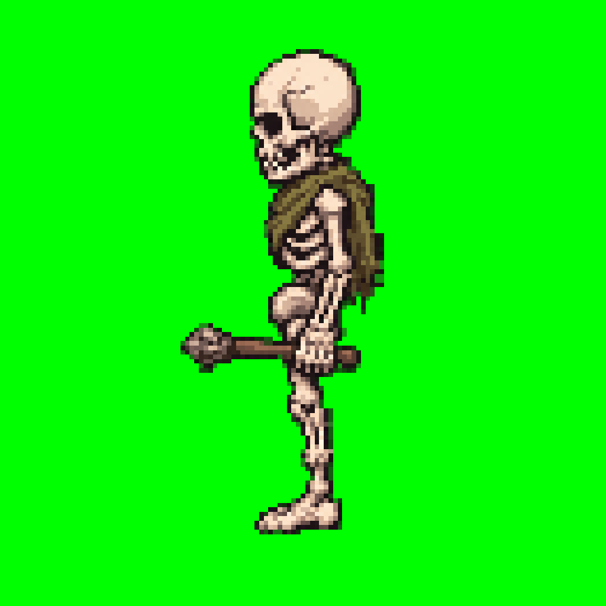
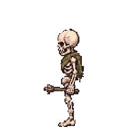
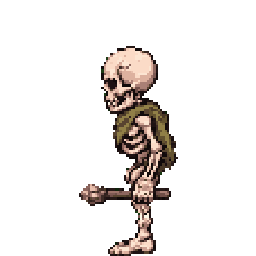
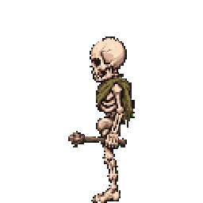
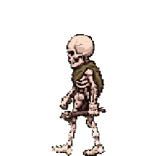

# Lobit Skeleton

Game-facing fixed-grid exports for the W-facing low-bit enemy skeleton.

## Character Manifest

[character.json](character.json)

## Anchor

## Animations

| Animation | Frames | FPS | Spritesheet | Preview |
|---|---:|---:|---|---|
| idle_w | 10 | 6 | [spritesheet](animations/w/idle/spritesheet.png) |  |
| attack_w | 8 | 10 | [spritesheet](animations/w/attack/spritesheet.png) |  |
| hurt_w | 6 | 8 | [spritesheet](animations/w/hurt/spritesheet.png) |  |
| jump_w | 6 | 8 | [spritesheet](animations/w/jump/spritesheet.png) |  |
| death_w | 10 | 8 | [spritesheet](animations/w/death/spritesheet.png) |  |
| walk_w | 7 | 10 | [spritesheet](animations/w/walk/spritesheet.png) |  |

Runtime format: `256x256` cells, 5 columns, transparent PNG spritesheets. These promoted animations have been passed through `spriterrific finalize-runtime`; grounded actions share a bottom anchor and jump preserves its vertical motion.

The W-facing run experiments are intentionally not promoted into this package yet because the current WAN outputs blur or detach the held stick.
